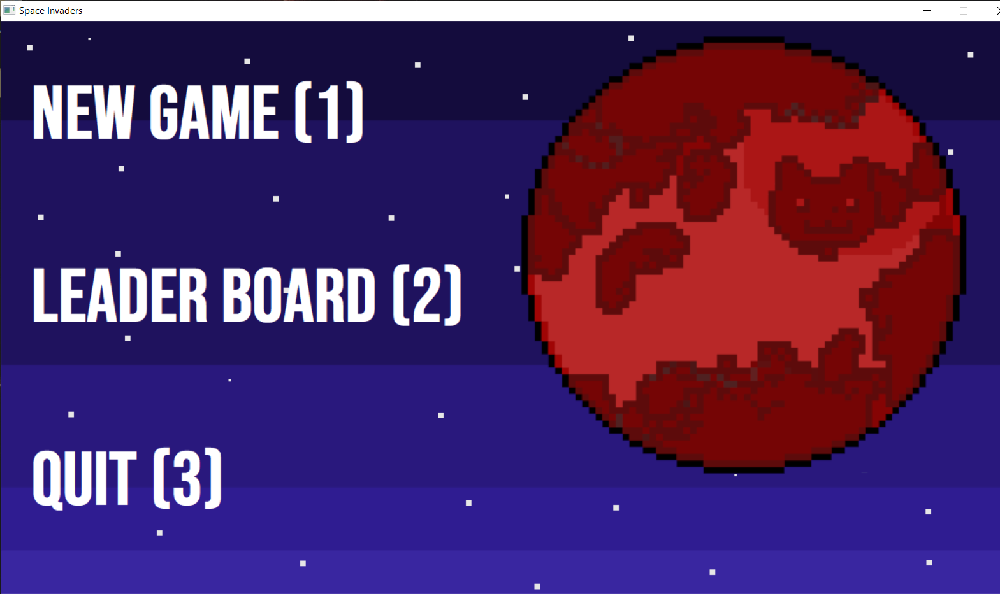
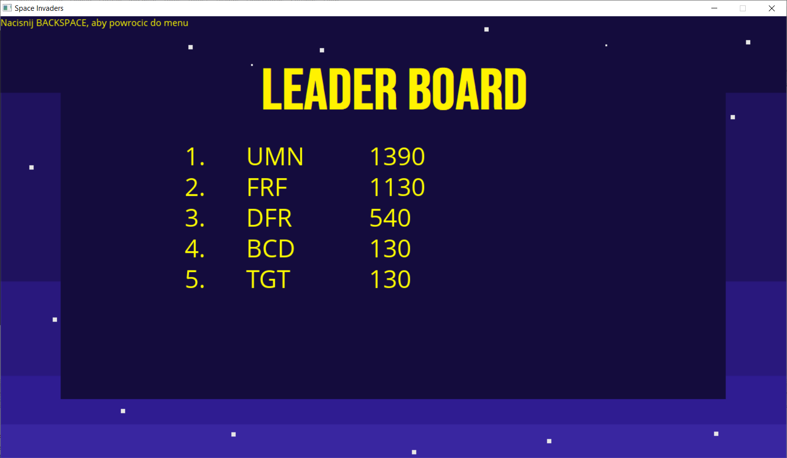
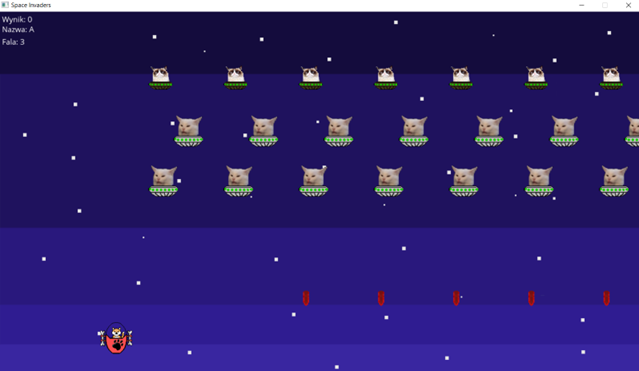
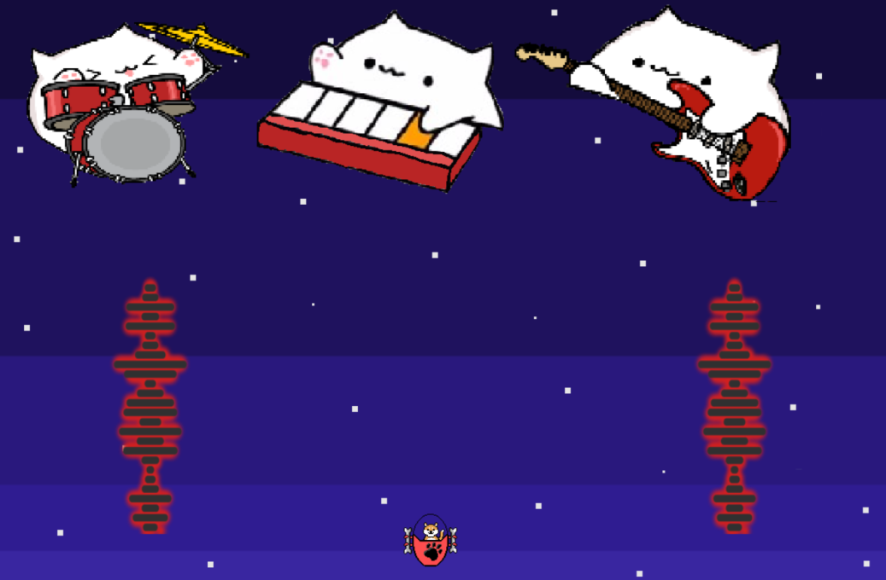
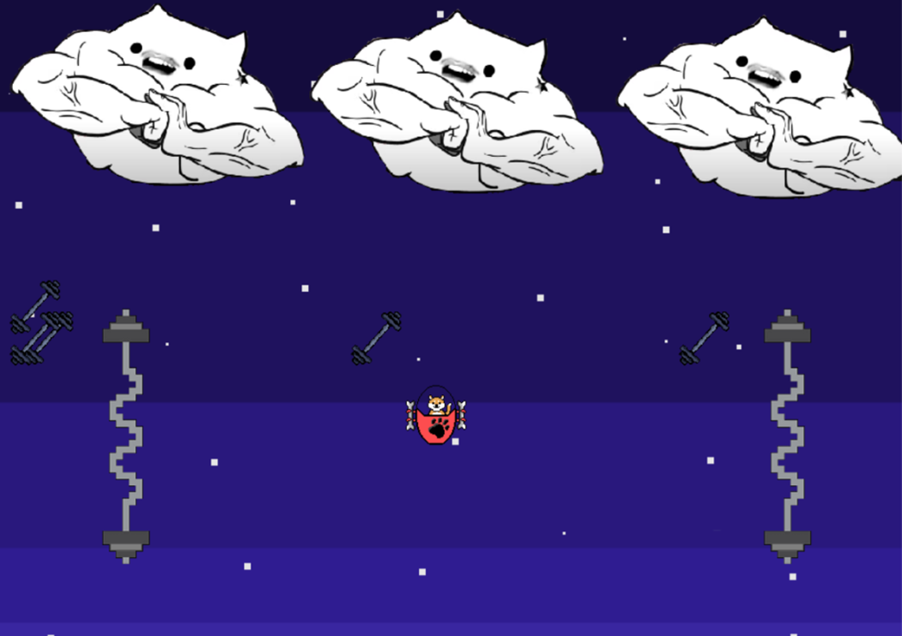

# SpaceCats
2D game inspired by Space Invaders with a cat theme. Game developed in 2020.

## Technologies Used
- C language
- Allegro 5.0.10 library - game engine

## Example Screenshots
### Menu

### Ranking

### Gameplay

### First boss

### Second boss

## Installation

Allegro 5 library needs to be installed before starting the application. It can be downloaded from [authors site.](https://liballeg.org/)

## Contribution
### Assets
- Bongo Cat Band
- Grumpy Cat
- Confused Cat
- Others
### Inspiration
- Space Invaders
